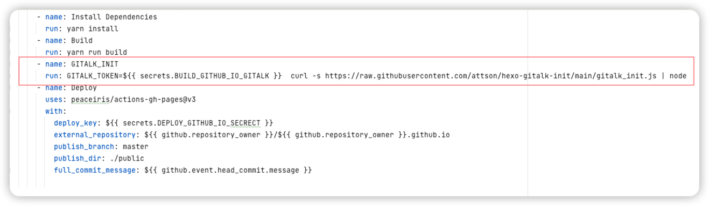
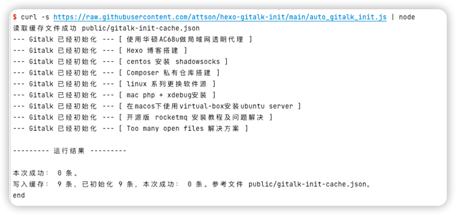

# hexo-gitalk-init

Hexo gitalk 轻量级初始化工具

## Feature

1. 无需安装其他的依赖，让你的hexo项目更干净
2. 不需要依赖或修改sitemap
3. 更适合自动化
4. 代码强迫症福音

## github workflows 极简使用



在 GitHub workflows 通常只需增加一个 GITALK_INIT stage, 并且只需添加 GITALK_TOKEN (Personal access token) 环境变量

```yaml
- name: GITALK_INIT
  run: GITALK_TOKEN=${{ secrets.BUILD_GITHUB_IO_GITALK }}  curl -s https://raw.githubusercontent.com/attson/hexo-gitalk-init/main/gitalk_init.js | node
```

## 完整使用步骤

### 1. 配置参数

* repo: 在不提供时, 会使用 ${username}.github.io 
* cacheRemote: 在不提供时, 会使用 https://${repo}/gitalk-init-cache.json`

#### 环境变量方式

```bash
# 在github workflows 中, 可以省略 GITHUB_REPOSITORY_OWNER, github默认会注入 GITHUB_REPOSITORY_OWNER
# https://docs.github.com/en/actions/learn-github-actions/environment-variables
export GITHUB_REPOSITORY_OWNER=attson

# 如果 储存评论issue的github仓库名 刚好是 GITHUB_REPOSITORY_OWNER.github.io, 可以省略 GITAK_INIT_REPO
export GITAK_INIT_REPO=attson.github.io

# 综上, 在github workflows 中, 通常只需要配置 GITALK_TOKEN 就可以了
export GITALK_TOKEN=<GITALK_TOKEN>
```

#### 本地文件方式

如果不喜欢使用环境变量，或者给定的环境变量名称不匹配，可以使用 json 文件，配置所需参数

在执行目录增加 gitalk_init.json

```json5
{
  "username": "attson",
  "repo": "attson.github.io",
  "token": "<GITALK_TOKEN>",
}
```

json 文件支持使用process.env 占位, 在 process.env.name 前后增加 {}

```json5
{
  "username": "{process.env.GITHUB_REPOSITORY_OWNER}",
  "repo": "{process.env.GITHUB_REPOSITORY_OWNER}.github.io",
  "token": "{process.env.GITALK_TOKEN}",
}
```

本地json文件

### 配置完成后, 执行命令

```bash
curl -s https://raw.githubusercontent.com/attson/hexo-gitalk-init/main/auto_gitalk_init.js | node
```



### 支持的配置

| 字段          | 说明                                  | 默认值（env存在，则默认使用env的值）                                                                                           | 说明                                                                                          |
|-------------|-------------------------------------|-----------------------------------------------------------------------------------------------------------------|---------------------------------------------------------------------------------------------|
| username    | GitHub repository 所有者 (必填)          | process.env.GITHUB_REPOSITORY_OWNER                                                                             | GitHub repository 所有者，可以是个人或者组织。对应Gitalk配置中的owner                                           |    
| repo        | 储存评论issue的github仓库名                 | process.env.GITAK_INIT_REPO     <br/> &#124;&#124;        `${this.username}.github.io`                          | 储存评论issue的github仓库名，仅需要仓库名字即可。对应 Gitalk配置中的repo                                             |    
| token       | GitHub 的 Personal access token (必填) | process.env.GITALK_TOKEN                                                                                        | 从 GitHub 的 Personal access tokens 页面，点击 Generate new token                                  |
| enableCache | 是否启用缓存                              | process.env.GITAK_INIT_CACHE &#124;&#124; true                                                                  | 是否启用缓存，启用缓存会将已经初始化的数据写入配置的 outputCacheFile 文件，下一次直接通过缓存文件 outputCacheFile 判断                |      
| cacheFile   | 缓存文件输出的位置                           | process.env.GITALK_INIT_CACHE_FILE   <br/> &#124;&#124; path.join(__dirname, './public/gitalk-init-cache.json') |                                                                                             |
| cacheRemote | 获取缓存的远程地址                           | process.env.GITALK_INIT_CACHE_REMOTE <br/> &#124;&#124; `https://${this.repo}/gitalk-init-cache.json`           | 只用于获取缓存的来源，缓存仍然会写到 cacheFile. 读取优先级 cacheFile > cacheRemote. 故cacheFile文件存在时，忽略 cacheRemote |
| postsDir    | hexo posts 文件路径                     | process.env.GITALK_INIT_POSTS_DIR <br/> &#124;&#124; 'source/_posts'                                            |                                                                                             |

